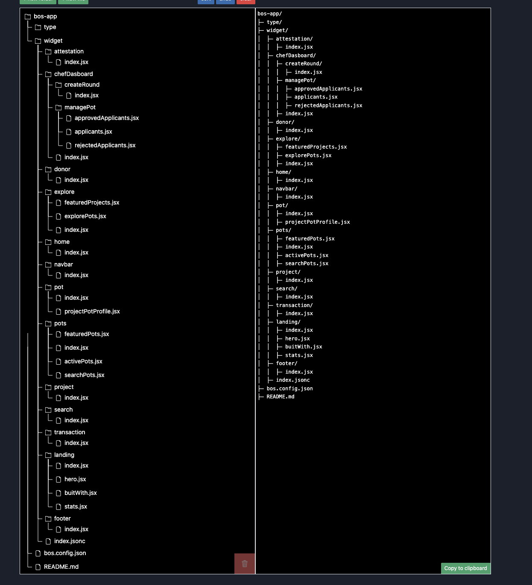

# ⚖ BOS Component Hierarchy (WIP)

You can directly fork our BOS App, but just in case you like to fork component by component and don't want to install annything locally here is how our application is structured.



If you want to see us build in public directly on figma check out [https://PotLock.io/figma ](https://potlock.io/figma)where our figma is located

<figure><figcaption></figcaption></figure>
