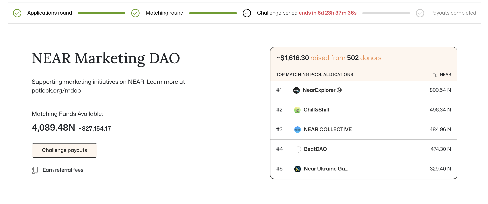

# 🥊 Challenging Pot Results

Considering quadratic funding rounds are based on humans, the actual calculations happen off chain, their could be room for collusion, we have built a process for anyone to issue on chain challenges during a cooldown period

A cooldown/challenge period starts after matching round when a [chef initiates it](chef-manual-or-run-a-qf-round-pot.md#cooldown-period) after processing off chain calculation and putting results on chain.

## Reason to Create A Challenge

* errors in bugs in the system: some donations wer eblocked when originally created. Changes to nada bot requirements.&#x20;
* **a miscalculation in matched amounts**: show evidence of the miscalculation
* someone clearly paying people to donate and using unfair incentives to favor them in a round: show evidence of this> Example nada.bot evidence.&#x20;
* the chef/owner/admin doing some wrong doing: show evidence of the transaction and them clearly  initiating transaction that is different
* &#x20;contests that a project is a scam, illegitimate or doesn't fit the criterion of the round (despite chef approval

## How to Create A Challenge

Go to the Pot and when the challenge period is live (you know based on the countdown) -> click the challenge payouts button. A popup will click. Attach your main challenges and a link to evidence. We prefer an onchain document with clear transactions with data to support. If you are using traditional documents please open sharing for viewing.

<figure><figcaption>
Create a challenge
</figcaption></figure>

## Seeing Result of Challenge

Please go to the Potlock community chat to bring up new challenges that need to be addressed so this can be communicate to a chef. If a chef accepts a challenge, that means they need to provide a action for how this will change results. A chef must reject a challenge with a reason. In that case it will have no affect on outcome.&#x20;

After cooldown period is done and all challenges have been addressed a chef can either update results or initiate payouts. A chef can flag paritcular donors

## Seeing Current Challenges

In the payouts tab of the Pot their will be a challenges drop down where you can see existing challenges.&#x20;

<figure><figcaption>
See payouts
</figcaption></figure>

## For Chefs (Flagging Donors & Readjusting Payouts)

<figure><figcaption>
Flag donors
</figcaption></figure>

All calculations are calculated using quadratic funding, but a Chef can actual flag donors to be omitted from this calculation based on challenges, omit projects, and manually toggle the amount based on executive decisions. However any change to calculated payouts need to go through another payouts period.&#x20;

<figure><figcaption>
manually tollge periods
</figcaption></figure>

