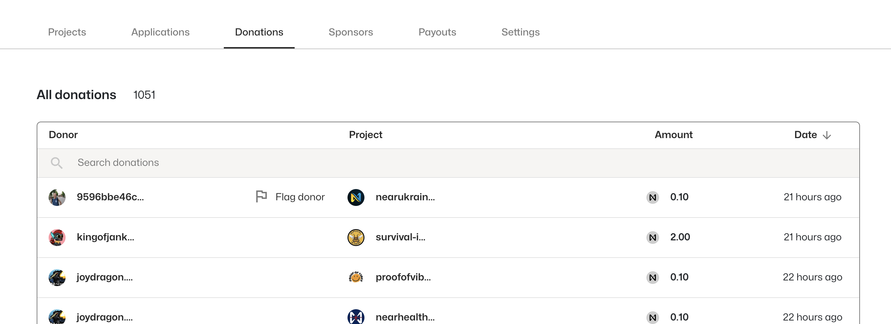

# 📝How to Create A Challenge

<figure><figcaption>
Challenge Payouts
</figcaption></figure>

1. Go to the Pot Page when the challenge period is active.
2. Click the "Challenge Payouts" button.
3. A popup will appear. Attach your main challenges and supporting evidence.
   * Preferred: On-chain documents with clear transaction data
   * Alternative: Traditional documents (ensure view-sharing is enabled)

## Seeing the Result of the Challenge

Please go to the POTLOCK community chat to bring up new challenges that need to be addressed so they can be communicated to a chef. If a chef accepts a challenge, they need to provide an action plan for how this will change results. A chef must reject a challenge with a reason. In that case, it will have no effect on the outcome.&#x20;

After the cooldown period is done and all challenges have been addressed a chef can either update results or initiate payouts. A chef can flag particular donors

## Seeing Current Challenges

In the payouts tab of the Pot, their will be a challenges drop-down where you can see existing challenges.&#x20;

<figure><figcaption>
See payouts
</figcaption></figure>

## For Chefs (Flagging Donors & Readjusting Payouts)

<figure><figcaption>
Flag donors
</figcaption></figure>

All calculations are calculated using quadratic funding, but a Chef can actually flag donors to be omitted from this calculation based on challenges, omit projects, and manually toggle the amount based on executive decisions. However, any change to calculated payouts needs to go through another payout period.&#x20;
