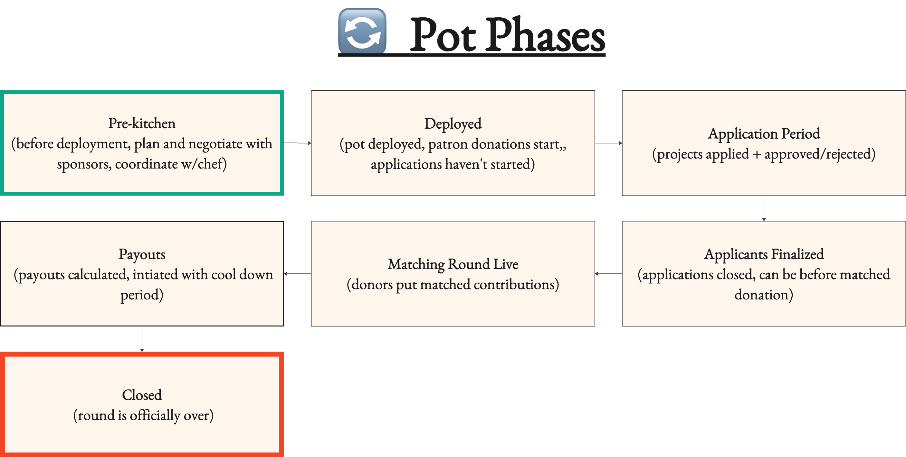

# 👨🍳 Pot Owners & Chef Training (Pot)

## Background

<figure><figcaption>
Chef Training
</figcaption></figure>

**First, what is a Pot, how are donors involved?**&#x20;

Pots are quadratic funding round contracts that sponsors can directly fund via a matching pool. They have a series of phases in which projects apply &  get accepted, donors (who usually met a human criterion) that donate through the pot directly to the approved projects, and projects  that are paid out from the pot’s matching pool when the round is over based on the donation (the formula for calculating this is called [quadratic funding](https://wtfisqf.com)).&#x20;

\

A Pot Owner, Admins (optional) and the Chef, see the success by bringing in sponsors, donors, and facilitating projects and initiating payouts.  &#x20;

### Difference Between Direct Donation at Matched Donations via Pot

Pots are quadratic funding rounds. Quadratic funding rounds for the user are different from direct donations. While donations during a quadratic funding round to the project goes directly to the project. Those donations are logged in the pot contract and used to calculate how much of the matching pool a project will get when the round is over. Unlike direct donations where anyone can donate to a project at anytime, a matching round has a requirement to donate and only live when the matching round is live. This requirement is usually being a human via nada.bot, a bot protection tool. This is to prevent people from scamming more donations to get more of the matching round out.

| **Direct Donations**                                                                                                             | **BOTH**                            | **Matched Donations (Quadratic Funding)**                                                                                                                                                                         |
| -------------------------------------------------------------------------------------------------------------------------------- | ----------------------------------- | ----------------------------------------------------------------------------------------------------------------------------------------------------------------------------------------------------------------- |
| 
Projects on registry (or anybody not through our front end) - registry is managed by Potlock protocol admins. 

 
 | WHO GETS DONATIONS?                 | 
Need to be accepted to round by chef or owner, and may also be required to be on Potlock registry (or custom registry of choice) 
                                                                       |
| 
Anyone can donate

 
                                                                                              | WHO CAN DONATE?                     | Only people who get approved as human on nada.bot (or another requirement based on what owner sets)                                                                                                               |
| YEAR ROUND on project page                                                                                                       | TIME: WHEN CAN THEY GET DONATIONS?  | Only when matching round is live for that pot.                                                                                                                                                                    |
| Their is only direct donations no matching rounds.                                                                               | WHO CAN SPONSOR?                    | Anyone can sponsor the matching rounds from when pot is deployed to payouts.                                                                                                                                      |
| Present for those. Lives on donation contract and shared when logged in through link.                                            | REFERRAL FEES                       | Lives on pot contract with max on pot factory. Referral fees from donation can be set different from sponsorship. Shared when logged in through link                                                              |
| donate.potlock.near                                                                                                              | Contract Name                       | \_[\_\_\_\_.v1.potfactory.potlock.near](https://github.com/PotLock/core/tree/main/contracts/pot) (deployed as subaccount through [pot factory](https://github.com/PotLock/core/tree/main/contracts/pot\_factory)) |

\
Who Is Everyone that involved

Alot of people in this kitchen&#x20;

🔑 Pot Owner: person who deploys pots and can change settings and do everything a Chef can do. Usually coordinates round and selects chefs and closes off chain sponsors. Can remove chef and other admins.&#x20;

\

💪🏿 Pot Admin(s) - Optional: specified by owner. Can do everything an owner can do except add or remove admins.

\

👩🏿‍🍳 Chef: appointed account responsible for approving applications, supporting donors, and can collect automated fees for donations and sponsorships

\

🙏 Verified Donors: people who verify as a human through nada.bot (or other verification requirement in species, and that can donate to a project through round to get matched

\
\

🥯 Sponsors: anyone can donate to the entire round and their logo (aka near.social profile picture) shows up on sponsor board. Usually most money comes from a committed sponsor before the round. Alternative to people who don’t want to verify and support the whole round instead of individual proejcts.&#x20;

\
\
🏥 Projects: projects that are applying. If they are approved they are often onboarding their network of donors in order to get a bigger matching round. They will be expecting to be notified when they get accepted, how to support their donors, and where there money was at.

## Biggest Challenges of A Round

Let’s be honest, it's a lot to manage your own quadratic funding round. You are dealing with advertising your round, onboarding sponsors, project, donor w/ verification via  [nada.bot](https://nada.bot), payouts and post pot engagement. You are dealing with the on-chain process but also communicating directly with teams in [support](https://potlock.org/community) channel. Luckily we are here to help and facilitate! \


Here is a list of the most difficult parts of managing a quadratic funding round/pot:


**Getting your committed sponsors to do an onchain donation directly to the round**

* &#x20;to create a profile and directly donate in NEAR to sponsor.&#x20;
* You may need to onramp, or even create an account to bridge and create a wallet with near social profile to donate with their accounts
* Its ideal they make their own account

**Marketing the Round:** Social media and coordinating with Potlock brand. Getting people to apply and getting donors outside of the existing network. .&#x20;

**Keeping Applicants Up to Date:** Letting applicants know if they got rejected or accepted. We currently do not have an email service as approval and rejections for applications are on chain. One way to get relatively helpful notification is through [LEARN NEAR WATCH bot ](http://https/t.me/nearwatchbot)or a mobile HERE wallet to get notifications about any on chain changes. So this will require direct communication with applicants for updates in their status. Get people to be on registry.

* It wont show to donate, until the matching round is there, and they will only show on registry

**Getting People to verify humanity through nada.bot:** [Nada.bot](https://app.nada.bot) can be tricky as it requires users to go on nada.bot, go to third party app and verify a credential, come back to add and reverify on the nadabot contract ot get enough “points” to be a human. Then after they are human only then are they eligible to donate. This process is difficult currently in terms of UX, requires NEAR transaction fees, requires connecting to different apps, and isn’t permissionless. (This is to prevent people from matching rounds). If all else fails they can just donate to the overall matching amount (but they are donations don't get amplified, they would be displayed as sponsor who amplifies other donation)

\

They might donate directly to project and not in round, if they go to page and click donate

\
**If nada.bot gets botted or clear signs of collusion**: The nada.bot team may change what it means to be human and different requirements, and this may be seen as unfair. It also may hinder people that were previously considered human to no longer be before donations. It may also lead to. This is a new uncharted territory but be in the nada.bot/support team and set up communications with them so they can keep you informed of any changes. This will also make it more difficult for people to verify. The other way may be true, as being a human is too high a barrier of entry and weights may be changed and requirements may be lowered.\

## For Pot Owners & Admin

### Choosing A Chef

Selecting a Chef is important. This person should not only have domain expertise on the Pot's vertical or focus area to approve applications, but they should have knowledge of the Potlock platform (see us for training), a network to raise funds, custom support experience, and be a trustworthy person)

\

Managing Chefs & Sometimes Doing Chef Roles

* As a pot owner or admin you are responsible for keeping the chef in line and making sure their isn't any wrong doing. You always have the ability to select a new chef. Also since their can only be one chef and you have all the permissions of the chef, you may also be promoting the round, helping donors get verified, helping projects with application, approve projects with application and so forth.

Advertised Funds for Matching Are Put on Contract from Sponsors Account Ahead of Time

* Make sure if you are deploying a round that if you are marketing a round for certain amount, that sponsor put the matching amount directly in the contract after deployment. All payments and fees occur directly on chain.

Making Sure No Wrong Doing for Chef Payouts & Check Down During Cooldown Period

* The actual calculations taking donation information from the pot against matching amount to calculate what the quadratic

\

## For Owners

This is only relevant for Pot owners (but also admins who can change settings of a Pot0.

When you deploying a pot, you are creating your own contract. For this it will cost 4.4 NEAR. There are essential things to you can customize about your rounds

* ✏️I nformation: only thing you cannot change. The title of pot an description
* 📆 Dates: Applications start and end date and matching round start and end date. Your matching round cannot start before applications start. You can have applications open during matching round. You can also push back dates later. Applications denote when projects can apply and matching round denotes when people can start donating in round.&#x20;
* ﹪ Fees: protocol, referrers and chef fees. The factory contract, or the contract responsible for deploying this contract, has max protocol, referrers and chef fees, as a chef. These fees can be zero. A protocol fee takes a percentage of every matched donation and sponsor coming in. As well as Chef fee. The chef from this fees to incentivize more donations and more sponsorships to grow the Pot. The referrer fees is a link generated on sharing when a donation or sponsorship is made that gives a kick back. This is to incentivize the public to grow the pot. The public can see this by seeing in the settings.&#x20;
* ✅ Eligibility: Project & Donor Requirements. Pick the registry (list) that projects must be on to be eligible. This is usual the Potlock public goods registry (projects on [bos.potlock.org](https://bos.potlock.org)). Additionally donor requirements require, the check that donors must have in order to give a matched donation. This by default nada.bot is human which is a contract that allows users through app.nda.bot to verify different services to build up a human score. Also allows for aminum donation (optional)&#x20;
* 🧑‍🍳 Admins and Chef: Admins are people who can change settings as well as reallocated chefs.Admins are optional. Chefs are responsible for accepting applications. Admins and you as owner can do anything that a chef can do. Chef would be allocated fees for growing pot




Want to look at the code? Check out the [pot\_factory](https://github.com/PotLock/core/tree/main/contracts/pot\_factory) contract and the [pot](https://github.com/PotLock/core/tree/main/contracts/pot) contract here


### Settings Page

The settings page lets you know what the current configurations of a Pot is, and it also let’s you know any changes in settings to see if the owner has changed the matching round, application dates, fees, even whether you are a chef, pot name, max number of applicants, etc.

### What If The Chef "Spits in The Food"

Round managers are a huge vector of attack

Based on the current design of Potlock their is room for round manager corruption. This includes

* Rejecting application / approving applications (get off-chain kickbacks)
* Not approving in timely fashion
* Maliciously calculate payouts

## What is a Chef

A Chef is someone who manages a pot (a quadratic funding round). But like any chef, you don’t own the kitchen, you just make sure the meals are prepared. Similarly, you are not the one who who deployed the account, and if you are caught spitting in the food, plenty of people know how to cook


YOU SHOULD HAVE A TELEGRAM GROUP CHAT “ROUNDNAME / POTLOCK” (contact[ potlock community telegram](https://potlock.org/community) group to set this up if you haven’t already


### Responsibilities of a Chef

\

#### On-chain

As a Chef this means&#x20;

* &#x20;you approve and reject applications
* You can reject someone even if they have been approved. Please put a reason why as it posts it on-chain and allows for transparency. This may be the case of finding additional information or evidence of wrong doing.

Initiate Payouts - after round is over click payout buttons and then let cooldown period transpire for payout period to happen.&#x20;

\

Communicate with projects and donors

\

Get Funding into Pot&#x20;

* It is your responsibility to get additional funding into Pot. More money = more projects applying = more donors wanting to help them get money = makes your job easier.&#x20;

Why would there be bad actors exploiting the system?

We have a pot of money and the way to get more of it is by getting more donations. So naturally people will try to qualify through different wallets as human, donate a little to get more matched. There maybe clear money trail between projects and direct exploits / sybil attacks to system to get this fund. This may justify rejecting a project.. While the [nada.bot](https://nada.bot) team will be working to adjust human thresholds and stamp thresholds accordingly, we may covertly see that certain projects are gaming the system. Join the nada.bot/support channel to setup comms with the team.

### Advantages of Being A Chef

A Chef gets fees of donations and from sponsors; incentives are directly aligned. This means the chef will get an amount from all donations and all sponsorships coming to the round if this is available. The amount of fees is ultimately set by the owner of Pot (or who deploys the contract), additional there is a max cap on these fees. At the same time, fees might be zero for a round deployed by the owner, and also users and sponsors can opt out of fees.&#x20;

### Understanding Fees

Fees are ways to align incentives with every stakeholder. In our pot factory (a contract that deploys pots aka quadratic funding rounds) enforces a max fee on every pot that prevents owners and admins from going past a certain percentage. Additionally there is an option for sponsors and donors to not give any fees if they don’t want to. There can be a chef fee or protocol fee that takes a percentage from matched donations and sponsorships to the appointed chef at the time and to impact.sputnik-dao.near, the Potlock treasury. On the pot page there is a share button that copies in the logged in account as a referredId, when someone donates to a project (public round fee) or sponsors a pot, through this link, that referrer account is automatically paid out. This is to incentivize the Chefs to do a good job growing the pot, and for the public to also have incentives for growing the pot.

### Compensation for Chefs

* How much time does it take to facilitate a round?

How much time does it take to facilitate a round?

Rounds usually last, 2 weeks application period, 2 weeks matching round, 1 week payout with cool down, and 1 week retroactive (6 weeks in total), with the most support coming from applications helping project apply, and helping people donate in matching round (with alot of marketing).&#x20;

How many hours a week?

* 15 minutes everyday, checking project to apply daily
* 10 minutes helping respond to nada bot verification
* 10 minutes helping projects apply and providing NEAR
* 1 hour a week

How much am I expected to earn from fees?

If 5% chef fees and earn $20,000 rounds for example can earn $1,000 in fees. Fees and amount can verify for different rounds.

Is there any form of retroactive funding for Chefs?

In the future there can be. Gitcoin has shown success with this for [Gitcoin Citizens Rounds](https://www.gitcoin.co/blog/citizens-round-a-case-study-retroactive-qf)

## Differences Between Chef & Pot Owner

This is different from an owner. An owner deploys a pot as its own contract, sets fees you as a chef earns, number of applications. It is also important the owners can also update fees and settings.&#x20;

\

Some crucial step is the calculation happens off chain and has a cooldown period so others can audit that this calculation is done correctly. Then YOU (or owner / admin) needs to initiate payout.

\
Although anyone can deploy their own POT in our factory contract, only certain people will be whitelisted to display from our UI. If you want to deploy your own round, you can deploy your own gateway.\

<figure><figcaption>
Chefs vs Pot Owners
</figcaption></figure>

## Stages of A Pot

<figure><figcaption>
Stages of quadratic funding round (Pot)
</figcaption></figure>

## How Projects Apply

Project must apply. One of the things for projects that will be confusing is that

\

1\. Get A Project NEAR Account: First they need a project account on NEAR, preferably a named account representing their organization (example potlock.near). We recommend at least having 1 NEAR around $2-$4 depending on the market, to save their on chain profile and do other things. This will be the case for most projects if they are not already in NEAR ecosystem, To do this a [keypom.xyz](https://keypom.xyz/) link with 1 NEAR in it should be given or they should make an account on [https://wallet.meteorwallet.app/wallet](https://wallet.meteorwallet.app/wallet) and you should then transfer funds to them. If projects need support for this then join the [https://potlock.org/community](https://potlock.org/community) where we will provide with associated fees for project onboarding.&#x20;

\

2\. Apply to Project Registry: Next step is to create a project on Potlock, which asks them to fill out their profile information, past funding, team information etc. For how to create a project [https://docs.potlock.io/user-guides/create-your-project](https://docs.potlock.io/user-guides/create-your-project).

\

4\. Get Accepted to Project Registry.  As of right now projects will be pending on registry and must be approved by Potlock admin. Please go to [Potlock telegram](https://potlock.org/community) and under “new-project-registration” channel let Potlock core team now you have applied so you get accepted or rejected with the link to your project. It will say what status your project is in with no banner if it is approved.&#x20;

\
3\. Go To Round During Application Period And Apply: Then a project will need to go to the pot when the application period is open and apply.&#x20;


how to apply to a pot as a project



DIRECT DONATIONS are not DONATIONS through Pots. Make sure that matched donations are by people who meet nada.bot requirements and its done through the pot and not through the project page.



Confusing parts: they may think that direct donations to project don't count.



Project get donations immediately, this is not kept on contract, just tracked in order to calculate how much is matched from pools at end


## Approving Projects

Projects can be accepted or rejected with a reason on chain by Chef owners, admins or chefs. However this should be done by the Chef unless there is a backlog.&#x20;

\

Reasons for rejections may be

* Not a public good in the round
* Not a project that fits the scope of that Pot’s vertical
* Had a history of not delivering or malicious activity

\

Some projects may have difficulty applying as&#x20;

* They need to be approved on the registry first
* Go back to pot
* May not have enough NEAR for transaction fees
* May be waiting ot long to apply


Apporving or rjecting projects


## Supporting Donors

Biggest challenges with donors. To get matched donations there are currently hurdles for donors.&#x20;

1. Donors need to create a wallet (preferably a named account) and have NEAR to pay for transactions, and also to pay for stamps to be a human. Allocate at least .5 N $2 for donors. Users will need to save their private keys
2.
   1. This means they will need to use an onramp (click here for available on-ramp options)
   2. Another alternative is to create a [keypom](https://keypom.xyz/) linkdrop where you preload NEAR for someone to use

Nada.bot verifications: In order to get a matched donation they need to verify to be a human with a nada.bot stamp/This involves signing into the app, going to a 3rd party provider, verifying with another contract (requires NEAR for transaction), and then going back to stamp and verify with our contract until they meet the threshold.


Verifying a check via nada.bot


* Understanding the difference between direct donations: users can directly donate to a project. Make sure they are donating through a matched round.&#x20;
* Users won't  know how much will get matched until payouts are done.

## Sponsors

* They need to onboard Fiat to NEAR, and then create account and donate from NEAR.social account for logo to show on sponsor
* If they cannot then take payment for it, onramp to near and make an account that represent organization, but this is not preferred


how to sponsor a pot / quadratic funding round on Potlock


**Have sponsors edit their profile**

Sponsor can edit their NEAR social profile. Have them login and go ot my profile

<figure><figcaption>
sponsor board
</figcaption></figure>

Save profile, and the board will dynamically pull this logo

<figure><figcaption>
Edit profile
</figcaption></figure>

## Paying People

After a matching round is over, the chef or pot owner needs to initiate a transaction to payout. Which  calculates how much each project gets paid off chain and put results on contract. Then to initiate payouts. Payouts have a cooldown period for any challenges, but then the Pot will payout all project applications their matched amounts.

\
\

Cooldown Period

The only thing that happens off-chain, is the quadratic funding payout. This is why there is a cooldown period seen here after a payout has been initiated with a t timer. This is x amount of time (usually \_\_\_), until payouts are initiated. This allow anyone to challenge any wrong doing or miscalculations of offchain calculation.&#x20;

\

## After A Round

After a round things are not over. We want to follow up with projects. It's important that projects share their experience, we can keep track of the rounds to improve, and pipeline to new funding opportunities, and get projects to continue to attest.&#x20;

* To let them know they get paid. Any possible offramping.&#x20;
* To make sure that donors are attesting
* To have them share on social media via templates. Copy templates at [https://potlock.org/canva](https://potlock.org/canva)&#x20;

\

Additionally work with the Potlock team to get messaging about overall round, and then get individual projects paid out to share their experience. Have projects copy the graphic templates (potlock.org/canva) for projects to share about how much donors they had, how much direct donations, and how much matched amount they got.  and what they plan to do for the funds. Encourage them to connect twitter to NEAR.social to make a post so it shows up.&#x20;

## How to Pitch

Outside of using the platform, what are way to pitch to projects, sponsors, and donors.

Pitching to Projects

* Not just finding supporters and getting financial support
* Build reputation, be eligible for future rounds
* Discovering other people in public goods. space

\

Pitching to Sponsors

* Get your logo shown
* Support cohort of projects
* Alignment with public godos ecosystem

\

Donors

* Support your favorite project, and impact with not just your donation but against matching pool.

## Our Quadratic Funding Rounds vs Gitcoin

* At any point of a round the matching amount can get bigger as anyone can donate, while the sponsor board dynamically changes. So as traction increases anyone can increase pot
* For bringing in new sponsors, there is referrer id, which has associated fees
* A chef can have fees and a protocol can have fees for all donations and sponsorships to matching rounds to aligned incentives (check settings for this)
* There is an owner and a chef. Anything an owner can do a chef can do. An owner sets all associated fees and deploys the contract (takes 5 NEAR -> this is entirely NEAR protocol contract deployment cost).&#x20;
* We do not have keys to pot-factory contract which deploys round (check changelog), and owners deploy the pot, which no one has the keys to.&#x20;
* When a pot is deployed on the front end we default to nada.bot isHuman function for donation requirements, and potlock public goods registry for requirements, however different sybil providers can be chosen that fit the is\_blank(account\_id): bool format, which is what all providers use for nada.bot. Nada.bot abstract different sybil providers by aggregating stamps, setting scores and managing human threshold dynamically on threshold level.
* Our gitcoin passport = nada.bot which is all based on onchain stamps. Need to be a human according to nada.bot or whatever sybil check is provided
* You can earn referral fees (fee is set by pot deployer)
* Project profiles are global and linked to your social profile. Use this to apply and connect to social feed
* Project can be donated directly from their project page. However, this is not counted as a matched donation for pot.&#x20;
* Direct donations go directly to user before fees, but that donation struct or data type is stored on the the pot contract, letting&#x20;
* Matching Payouts are first calculated when round is over via off chain, then payouts are initiated in which a cooldown period is activated for auditors to verify results.
* Are fees calculated with the matched amount?

For those who are familiar with quadratic funding rounds we will outline the differences between Gitcoin and Potlock quadratic funding rounds.

## Your Most Helpful Resources

* Potlock Community Telegram: support channel to answer any questions [https://potock.org/community](https://potock.org/community)
* Your direct telegram with Potlock team
* Documents [Docs.potlock.io](https://docs.potlock.io)
* Your chef training doc (this) [potlock.org/chef-training ](https://potlock.org/chef-training)
* Potlock BOS App [https://bos.potlock.org](https://bos.potlock.org)
* Potlock Tutorials [https://potlock.org/tutorials](https://potlock.org/tutorials)&#x20;

\

\
