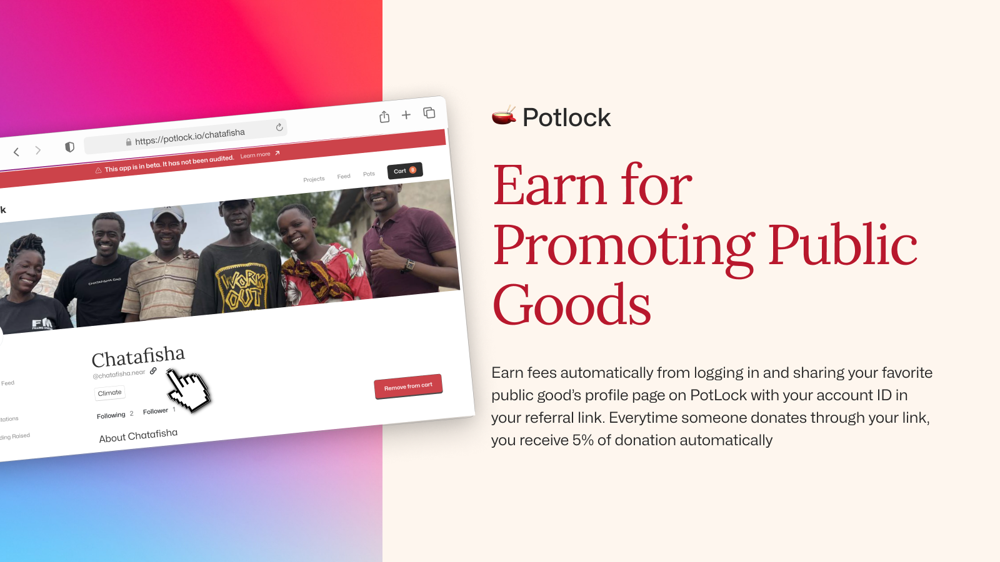

# 💸 Create Project Referral Link

<figure><figcaption>
Earn through referral fees
</figcaption></figure>


Referral links&#x20;


One of the best things about PotLock, is we are aligning incentives for citizens, and those helping grow the pot, by doing automatic on chain referrals + payouts. And its super easy. All you need to do is go to your favorite project page when you are logged in and click the share button.

<figure><figcaption>
Click the link button to get your referral link if you are logged in
</figcaption></figure>

When a project then goes through your link, the referred account in props will be added to project in local storage (you can see this on project breakdown).

<figure><figcaption>
Project breakdown indicating who the referrer is
</figcaption></figure>

Or if you are into tinkering and not logged in you can simply [https://near.social/potlock.near/widget/Index?tab=project\&projectId=magicbuild.near\&referrerId=potlock.near](https://near.social/potlock.near/widget/Index?tab=project\&projectId=magicbuild.near\&referrerId=potlock.near) replace potlock.near as the referredId in the props to the account of your choice&#x20;
