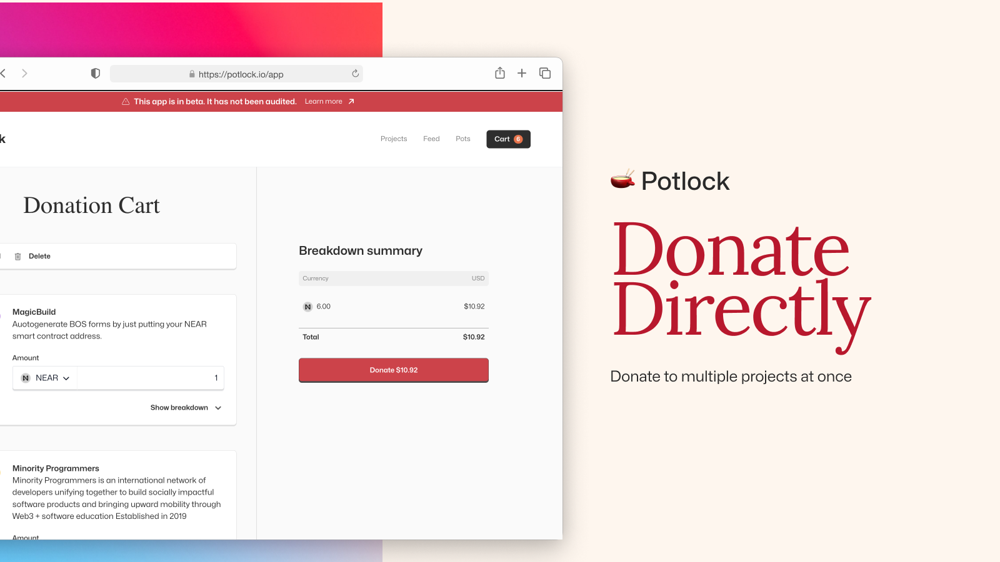

# 🙏 Donate to A Project


Donating directly is different than [donating to a project through a Pot / quadratic funding roun](matched-donations-or-donate-through-a-pot.md)d.&#x20;


<figure><figcaption>
Directly support your favorite public goods year round
</figcaption></figure>


Donate Directly to your preferred project


You can directly donate to a public good by going to the [project explore page](https://potlock.io/explore) (the homepage for now), clicking on a project page and then donating

<figure><figcaption></figcaption></figure>

Here is an example of a project page. Go to add to cart. You can then go back to explore page and add additional projects to cart. Check what is in your cart, and click proceed to donate to go to your cart page.

<figure><figcaption>
Cart in the navbar
</figcaption></figure>

<figure><figcaption></figcaption></figure>

Once you add to cart you can click on cart then proceed to donate to then trigger a transaction.

The default amount for each item in the cart is 1 NEAR, you can change this by changing the amount.

<figure><figcaption></figcaption></figure>

Considering that cart is based on your computer's local storage, if you haven't logged in then you must login and have the minimum balance to cover the donation. **YOU MUST HAVE at least .1 NEAR to donate per project.**

If you want to get a better understand of fees, see which of the donations have a referrer fee and any gas / transaction fees per project donation, click on donation breakdown.&#x20;

After the donation, it should trigger a transaction, and clear the cart. You can view the transaction on nearblocks.io and use this for any tax purposes.&#x20;

## Fungible Token Donations

You can also donate any fungible token (USDC, Memecoins, etc) directly to a project. Where it says NEAR their should be a drop down showing all the meme tokens in your wallet you can donate.

<figure><figcaption></figcaption></figure>

Based on storage costs and allowances, it can cost around 10 cents transaction fees to make a fungible token donation

