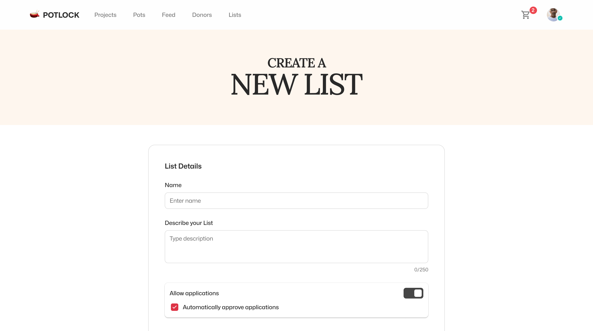

# Create List

### Step-by-Step List Creation Process

<figure><figcaption>
Create List
</figcaption></figure>

1. ### Access List Creation

**Navigate to the PotLock Website**: Open your web browser and go to [PotLock's List Creation Page](https://potlock.org/list).

**Log in to Your Account**: Ensure you are logged into your PotLock account. If you don’t have an account, you will need to create one before proceeding.

2. ### Enter List Title

**Provide a Concise, Descriptive Title**: In this field, enter a title that clearly reflects the focus of your list (e.g., "Sustainable Energy Projects"). This title will help users quickly understand the purpose of your list.

3. ### Enter List Description

**Offer a Brief Overview**: Write a short description that outlines the goals and scope of your list. This could include the types of projects included, the target audience, or any specific themes. A well-crafted description helps attract potential donors and participants.

4. ### Application Settings

**Admin Only Applications (Automatic Approval)**: If you select this option, any project applications submitted will be automatically approved without further review. This is suitable for lists where you trust all applicants.

**Manual Approval (Unticked)**: If you prefer to review each application before approval, leave this option unticked. This allows you to ensure that only appropriate projects are included in your list.

<figure><figcaption>
Add Admins &#x26; Accounts
</figcaption></figure>

5. ### Add Projects Directly

**Enter Project NEAR Wallet IDs**: Instead of waiting for projects to apply, you can directly add them to your list. Enter the NEAR wallet IDs of the projects you wish to include. This feature allows for quicker assembly of your list and ensures that key projects are immediately recognized as part of your collection.

6. ### &#x20;Permissions - Add Admin

**Optional: Enter Admin NEAR Account ID**: If you want to add additional administrators to help manage the list, enter their NEAR account ID here. These admins will have the ability to approve applications and manage the list alongside you.

7. ### Upload List Cover Image

**Optional but Recommended**: Choose a distinctive cover image that represents your list visually. This image will make your list more recognizable and appealing to users. If you do not upload an image, a default one will be used.

\
