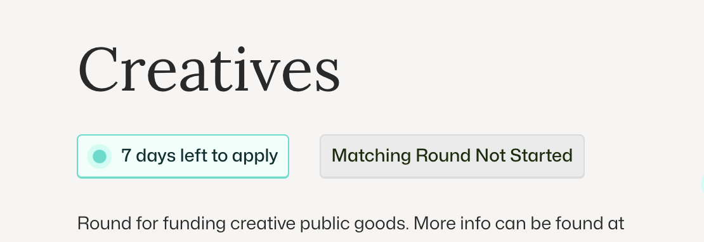
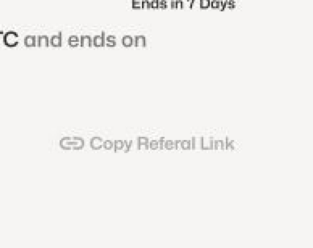

# 💗 Matched Donations | Donate Through A Pot

Matched donations are only live during the matching period. Donors need to verify their identity, usually through nada.bot, in order to donate.

<figure><figcaption>
Matching round has not started so cannot donate to a project in this round
</figcaption></figure>

## FAQ

How do I know how much of the pool my donation will be matched by?

**YOU WILL NOT KNOW TILL THE END OF ROUND.** Although we can provide estimates, this is ultimately calculated at the end by every donation via Quadratic funding. So its not just your donation, but your donation and the amount in relation to other unique donors to their amount across all projects. To get more matched to your project get other people to support with unique donations. Note that there can be a judges weight which only looks at QF as a factor. Moreover, there are [additional QF rules](../general-information/code-of-conduct/qf-rules.md)

Can I earn through my referral link for donations.

Yes, if someone donates through your referral link you will earn the amount specific in public round for donations in Pot settings. You can also gain referrals to sponsorships to increase the whole pot (as well as direct donations to project). You must make sure you accountId is in refferrerId of the url.

<figure><figcaption></figcaption></figure>

How do I know if I am eligible to give a matched donation?

You will be informed of your eligibility when you attempt to donate through the pot.

How do I know if I added a donation to a pot instead of just a regular donation?

There will be a tag in the cart section or on the popup that displays the name of the round.

Where are the best on-ramping services to get NEAR?

Currently, pots only support NEAR for quadratic funding rounds, while fungible tokens are supported for direct donations. If you have another token on NEAR, please use [app.ref.finance](https://app.ref.finance/) to swap it.

How do I know how much my donation was matched?

The estimated amount shown in the user interface is not final. You can only see the actual matched amount when payouts are initiated in the "Payouts" tab of the pot page

## Supporting Donors

Biggest challenges with donors. To get matched donations there are currently hurdles for donors.&#x20;

**Wallet Creation:** Donors need to create a wallet (preferably a named account) and have NEAR to pay for transactions and stamps to verify their identity as human. It is advisable to allocate at least 0.5 NEAR (approximately $2) for this purpose. Users must also save their private keys

**On-Ramping:** This means they will need to use an on-ramp (click here for available on-ramp options). An alternative is to create a Keypom linkdrop where you preload NEAR for someone to use.

**Nada.bot Verifications:** To receive a matched donation, donors must verify their identity with nada.bot. This involves signing into the app, going to a third-party provider, verifying with another contract (which requires NEAR for the transaction), and then returning to stamp and verify with our contract until they meet the threshold.


Verifying a check via nada.bot


### Understanding the Difference Between Direct Donations

Users can directly donate to a project; however, it is essential that they donate through a matched round. Users won’t know how much will be matched until payouts are completed.

##

