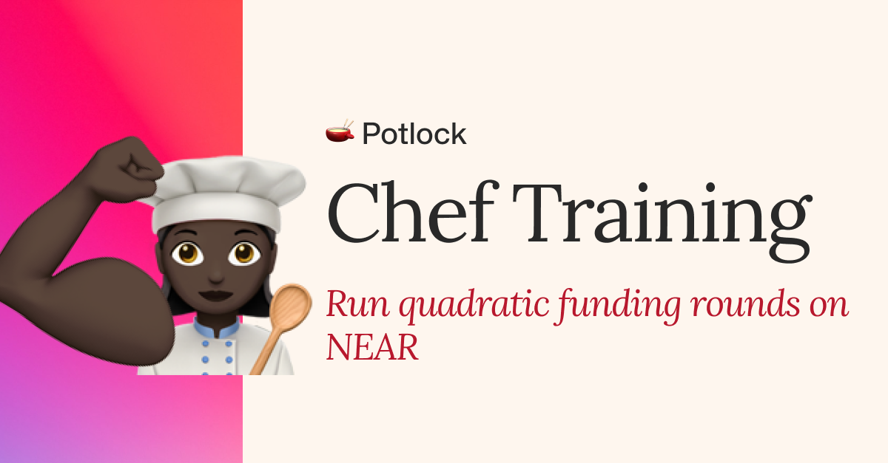
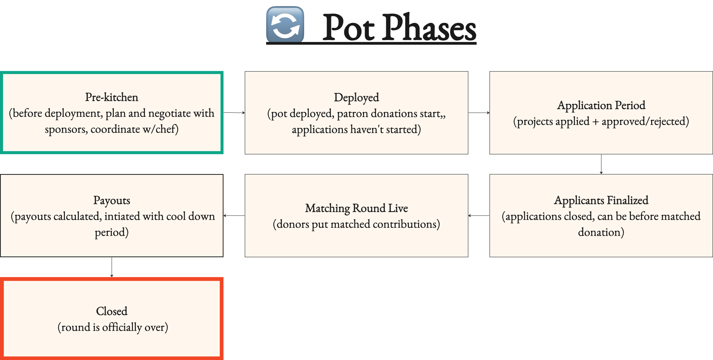

# 👨‍🍳 Pot Owners & Chef Training (Pot)

<figure><figcaption>
Chef Training
</figcaption></figure>

**First, what is a Pot, how are donors involved?**&#x20;

A Pot is a smart contract that manages quadratic funding rounds. Think of it as a special funding pool where donations can have a multiplied impact through matching funds. Each Pot goes through specific phases and involves different participants working together to support public goods.

**Key Participants:**

1\. **Sponsors**: Provide funds to the matching pool


[sponsors-or-funding-a-matching-round.md](../sponsors-or-funding-a-matching-round.md)


2\. **Donors**: Contribute directly to projects during the funding round


[donors](../donors/)


3\. **Projects**: Apply and receive both direct donations and matched funds


[projects](../projects/)


4\. **Administrators**:

\- Pot Owner

\- Admins (optional)

\- Chef (manages round execution)

Pots are quadratic funding round contracts that sponsors can directly fund via a matching pool. They have a series of phases in which projects apply &  get accepted, donors (who usually met a human criterion) that donate through the pot directly to the approved projects, and projects  that are paid out from the pot’s matching pool when the round is over based on the donation (the formula for calculating this is called [quadratic funding](https://wtfisqf.com)).&#x20;

A Pot Owner, Admins (optional) and the Chef, see the success by bringing in sponsors, donors, and facilitating projects and initiating payouts.  &#x20;

### Difference Between Direct Donation at Matched Donations via Pot

Pots are quadratic funding rounds. Quadratic funding rounds for the user are different from direct donations. While donations during a quadratic funding round to the project goes directly to the project. Those donations are logged in the pot contract and used to calculate how much of the matching pool a project will get when the round is over. Unlike direct donations where anyone can donate to a project at anytime, a matching round has a requirement to donate and only live when the matching round is live. This requirement is usually being a human via nada.bot, a bot protection tool. This is to prevent people from scamming more donations to get more of the matching round out.

| **Direct Donations**                                                                                                             | **BOTH**                            | **Matched Donations (Quadratic Funding)**                                                                                                                                                                        |
| -------------------------------------------------------------------------------------------------------------------------------- | ----------------------------------- | ---------------------------------------------------------------------------------------------------------------------------------------------------------------------------------------------------------------- |
| 
Projects on registry (or anybody not through our front end) - registry is managed by Potlock protocol admins. 

 
 | WHO GETS DONATIONS?                 | 
Need to be accepted to round by chef or owner, and may also be required to be on Potlock registry (or custom registry of choice) 
                                                                      |
| 
Anyone can donate

 
                                                                                              | WHO CAN DONATE?                     | Only people who get approved as human on nada.bot (or another requirement based on what owner sets)                                                                                                              |
| YEAR ROUND on project page                                                                                                       | TIME: WHEN CAN THEY GET DONATIONS?  | Only when matching round is live for that pot.                                                                                                                                                                   |
| Their is only direct donations no matching rounds.                                                                               | WHO CAN SPONSOR?                    | Anyone can sponsor the matching rounds from when pot is deployed to payouts.                                                                                                                                     |
| Present for those. Lives on donation contract and shared when logged in through link.                                            | REFERRAL FEES                       | Lives on pot contract with max on pot factory. Referral fees from donation can be set different from sponsorship. Shared when logged in through link                                                             |
| donate.potlock.near                                                                                                              | Contract Name                       | \_[\_\_\_\_.v1.potfactory.potlock.near](https://github.com/PotLock/core/tree/main/contracts/pot) (deployed as subaccount through [pot factory](https://github.com/PotLock/core/tree/main/contracts/pot_factory)) |




Want to look at the code? Check out the [pot\_factory](https://github.com/PotLock/core/tree/main/contracts/pot_factory) contract and the [pot](https://github.com/PotLock/core/tree/main/contracts/pot) contract here


### Settings Page

The settings page lets you know what the current configurations of a Pot is, and it also let’s you know any changes in settings to see if the owner has changed the matching round, application dates, fees, even whether you are a chef, pot name, max number of applicants, etc.

### What If The Chef "Spits in The Food"

Round managers are a huge vector of attack

Based on the current design of Potlock their is room for round manager corruption. This includes

* Rejecting application / approving applications (get off-chain kickbacks)
* Not approving in timely fashion
* Maliciously calculate payouts

## Stages of A Pot

<figure><figcaption>
Stages of quadratic funding round (Pot)
</figcaption></figure>


Apporving or rjecting projects


### [Post Pot](../planning-a-pot/#after-payouts-creating-a-round-retrospective) -> Retro + Keep Projects Engaged

###

## Our Quadratic Funding Rounds vs [Gitcoin](https://gitcoin.co)

* At any point of a round the matching amount can get bigger as anyone can donate, while the sponsor board dynamically changes. So as traction increases anyone can increase pot
* For bringing in new sponsors, there is referrer id, which has associated fees
* A chef can have fees and a protocol can have fees for all donations and sponsorships to matching rounds to aligned incentives (check settings for this)
* There is an owner and a chef. Anything an owner can do a chef can do. An owner sets all associated fees and deploys the contract (takes 5 NEAR -> this is entirely NEAR protocol contract deployment cost).&#x20;
* We do not have keys to pot-factory contract which deploys round (check changelog), and owners deploy the pot, which no one has the keys to.&#x20;
* When a pot is deployed on the front end we default to nada.bot isHuman function for donation requirements, and potlock public goods registry for requirements, however different sybil providers can be chosen that fit the is\_blank(account\_id): bool format, which is what all providers use for nada.bot. Nada.bot abstract different sybil providers by aggregating stamps, setting scores and managing human threshold dynamically on threshold level.
* Our gitcoin passport = nada.bot which is all based on onchain stamps. Need to be a human according to nada.bot or whatever sybil check is provided
* You can earn referral fees (fee is set by pot deployer)
* Project profiles are global and linked to your social profile. Use this to apply and connect to social feed
* Project can be donated directly from their project page. However, this is not counted as a matched donation for pot.&#x20;
* Direct donations go directly to user before fees, but that donation struct or data type is stored on the the pot contract, letting&#x20;
* Matching Payouts are first calculated when round is over via off chain, then payouts are initiated in which a cooldown period is activated for auditors to verify results.
* Are fees calculated with the matched amount?

For those who are familiar with quadratic funding rounds we will outline the differences between Gitcoin and Potlock quadratic funding rounds.

## 📚 Your Most Helpful Resources

* Potlock Community Telegram: support channel to answer any questions [https://potock.org/community](https://potock.org/community)
* Your direct telegram with Potlock team
* Documents [Docs.potlock.io](https://docs.potlock.io)
* Your chef training doc (this) [potlock.org/chef-training ](https://potlock.org/chef-training)
* Potlock BOS App [https://bos.potlock.org](https://bos.potlock.org)
* Potlock Tutorials [https://potlock.org/tutorials](https://potlock.org/tutorials) \
