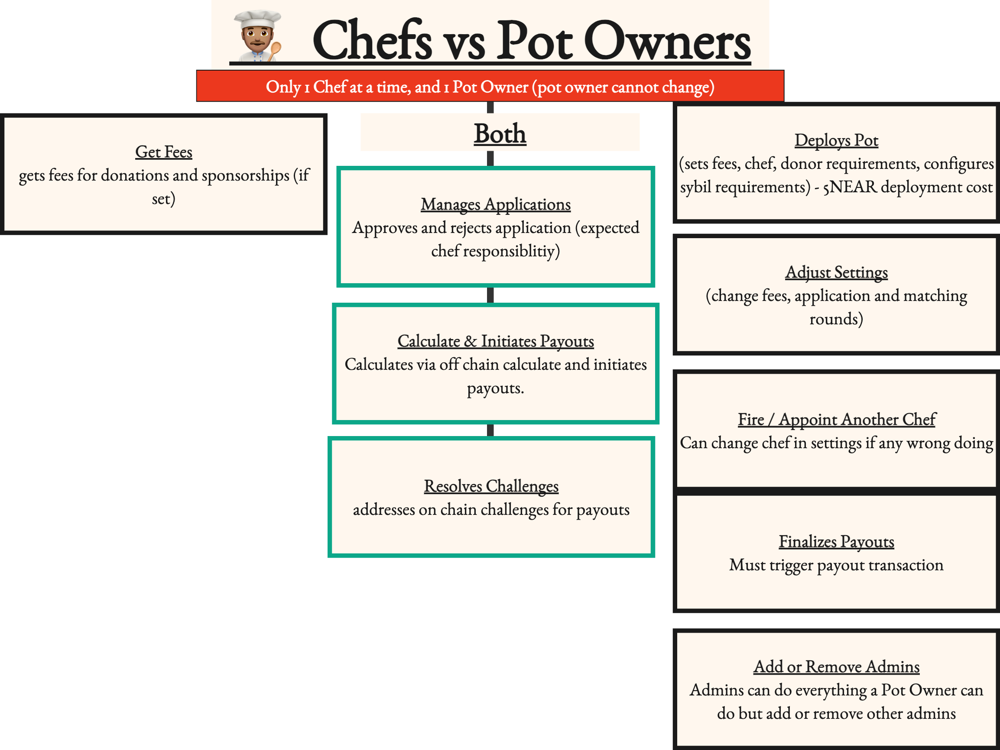

# 👨‍🍳Chef

A chef is someone who manages a pot (a quadratic funding round). However, like any chef, you don’t own the kitchen; you just ensure that the meals are prepared. Similarly, you are not the one who deployed the account, and if you are caught compromising the integrity of the process, there are plenty of others who can step in.To facilitate communication, you should have a Telegram group chat named “ROUNDNAME / POTLOCK.


YOU SHOULD HAVE A TELEGRAM GROUP CHAT “ROUNDNAME / POTLOCK” (contact[ POTLOCK community telegram](https://potlock.org/community) group to set this up if you haven’t already


### Responsibilities of a Chef

### On-Chain Responsibilities

As a chef, your responsibilities include:

* **Approving and Rejecting Applications:** You have the authority to approve or reject applications. If you reject someone who has already been approved, please provide a reason, as this will be posted on-chain to maintain transparency. This may occur if you find additional information or evidence of wrongdoing.
* **Initiating Payouts:** After the round concludes, click the payout button and allow the cooldown period to transpire before finalizing payouts. It is ultimately up to the owner and admin to complete the payout process.
* **Resolving Challenges:** Address any on-chain challenges regarding payout calculations before payouts can occur.

<figure><figcaption>
Example of a payout being resolved
</figcaption></figure>

* **Communicating with Projects and Donors:** Maintain open lines of communication with both projects and donors to facilitate a smooth funding process.

### Getting Funding into the Pot

It is your responsibility to attract additional funding into the pot. More money means more projects applying and more donors wanting to help them secure funds, which makes your job easier.

### Addressing Potential Bad Actors

Given that there is a pot of money available, some individuals may attempt to exploit the system by qualifying through different wallets as human or donating small amounts to receive larger matched contributions. There may be clear money trails between projects and direct exploits or Sybil attacks on the system. This could justify rejecting certain projects. While the nada.bot team will work to adjust human thresholds and stamp thresholds accordingly, we may notice that some projects are attempting to game the system. Join the nada.bot/support channel to set up communication with the team.

### Advantages of Being a Chef

As a chef, you earn fees from donations and sponsors; your incentives are directly aligned with the success of the pot. This means you will receive a portion of all donations and sponsorships coming into the round if applicable. The amount of fees is ultimately set by the owner of the pot (or whoever deploys the contract), and there is a maximum cap on these fees. Additionally, fees might be zero for rounds deployed by owners, and users and sponsors can opt out of fees.

### Understanding Fees

Fees help align incentives among all stakeholders. In our pot factory (the contract that deploys pots or quadratic funding rounds), there is a maximum fee enforced on every pot to prevent owners and admins from exceeding a certain percentage. Sponsors and donors also have the option not to incur any fees if they choose not to. A chef fee or protocol fee may take a percentage from matched donations and sponsorships directed towards the appointed chef at that time and to impact.sputnik-dao.near, which serves as the POTLOCK treasury. On each pot page, there is a share button that copies in your logged-in account as a referrer ID; when someone donates to a project (public round fee) or sponsors a pot through this link, that referrer account is automatically compensated. This incentivizes chefs to effectively grow the pot while providing public motivation for participation.

### Compensation for Chefs

How much time does it take to facilitate a round?

Rounds usually last, 2 weeks application period, 2 weeks matching round, 1 week payout with cool down, and 1 week retroactive (6 weeks in total), with the most support coming from applications helping project apply, and helping people donate in matching round (with alot of marketing).&#x20;

How many hours a week?

* 15 minutes everyday, checking project to apply daily
* 10 minutes helping respond to nada bot verification
* 10 minutes helping projects apply and providing NEAR
* 1 hour a week

How much am I expected to earn from fees?

If 5% chef fees and earn $20,000 rounds for example can earn $1,000 in fees. Fees and amount can verify for different rounds.

Is there any form of retroactive funding for Chefs?

In the future there can be. Gitcoin has shown success with this for [Gitcoin Citizens Rounds](https://www.gitcoin.co/blog/citizens-round-a-case-study-retroactive-qf)

### Differences Between Chef & Pot Owner

The roles of chef and pot owner differ significantly. An owner deploys a pot as its own contract, sets fees that chefs earn, and determines how many applications can be accepted. Owners can also update fees and settings as needed. A crucial step in this process is that calculations occur off-chain with a cooldown period so others can audit that these calculations are done correctly. After addressing any challenges, YOU (or an owner/admin) must initiate payouts.Although anyone can deploy their own pot using our factory contract, only certain individuals will be whitelisted for display from our user interface (UI). If you wish to deploy your own round, you can do so through your own gateway.

### Stages of a Pot

<figure><figcaption>
Chefs vs Potowner + Admins Diagram
</figcaption></figure>

### Approving Projects

Projects can be accepted or rejected by chef owners, admins, or chefs, but this task should primarily be handled by the chef unless there is a backlog of applications.

### Reasons for Rejections

Projects may be rejected for several reasons, including:

* **Not a Public Good:** The project does not align with the public good criteria established for the round.
* **Out of Scope:** The project does not fit within the specified vertical of the pot.
* **History of Malicious Activity:** The project has a track record of failing to deliver or engaging in harmful practices.

### Challenges for Projects During Application

Some projects may encounter difficulties when applying due to the following factors:

* **Registry Approval Required:** Projects must be approved on the registry before they can apply to the pot.
* **Insufficient NEAR for Transaction Fees:** Projects may not have enough NEAR to cover necessary transaction fees.
* **Delayed Application:** Projects may be waiting too long to submit their application, which can affect their chances of acceptance.&#x20;

### Cooldown Period

The only process that occurs off-chain is the quadratic funding payout. This is why there is a cooldown period after a payout has been initiated, typically lasting one week. This allows anyone to challenge any wrongdoing or miscalculations related to off-chain calculations.



Payouts have a cooldown period for any challenges. Reasons for challenging a pot may include:

* A miscalculation in matched amounts.
* Evidence of someone paying individuals to donate or using unfair incentives to favor them in a round.
* Wrongdoing by the chef, owner, or admin.
