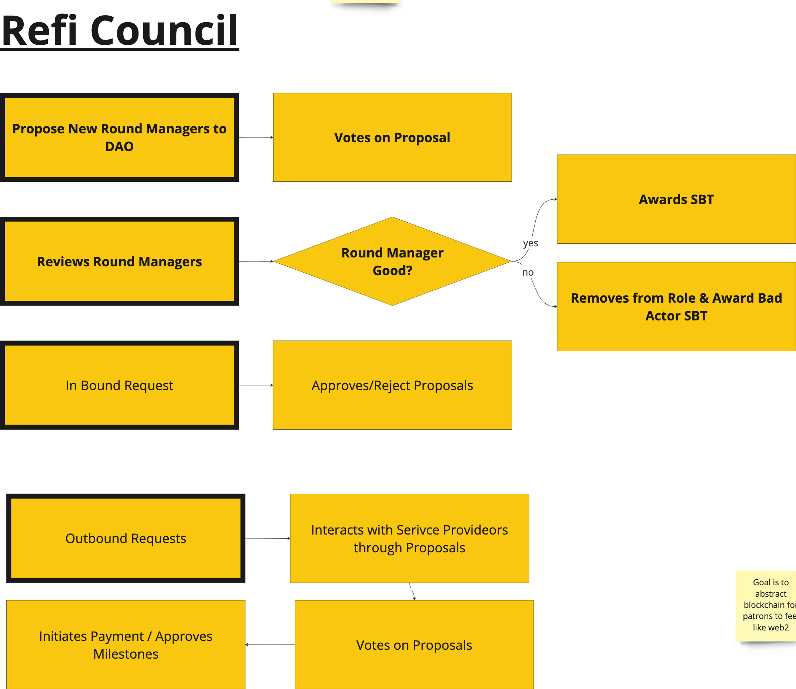

# 🏛 ReFI Council

* They appoint DAO members
* Act on overall NEAR ReFI Treasury
* According to Gursney Trust system similar to NDC Community Trust, CreativesDAO, and Marketing DAO Structure. Check out the [charter](https://nearefi.org/charter) for more information
* They appoint round managers (Chef). If any indications of bad actors then they can revoke round manager and issue a bad actor SBT.&#x20;

<figure><figcaption></figcaption></figure>
