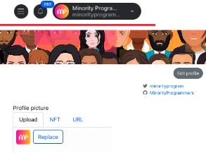

# 💰 Sponsors | Funding A Matching Round

Sponsors aka Patrons are different than Donors in that there donations are not matched. They are usually larger entities.

Sponsors need to onboard fiat to NEAR and then create an account from which they can donate using their NEAR.social account for their logo to appear on the sponsor board. If they cannot do this, they should use an on-ramp to NEAR and create an account that represents their organization, although this is not preferred.

### Editing Sponsor Profiles

Sponsors can edit their NEAR.social profile. They should log in and go to "My Profile" to make changes. After saving their profile, the board will dynamically pull their logo.

### Paying People

After a matching round is over, the chef or pot owner needs to initiate a transaction for payouts. This transaction calculates how much each project receives based on off-chain calculations and puts the results on-chain before initiating payouts.


how to sponsor a pot / quadratic funding round on Potlock


### Editing Sponsor Profiles

Sponsors can edit their NEAR.social profile. They should log in and go to "My Profile" to make changes. After saving their profile, the board will dynamically pull their logo.

<figure><figcaption>
sponsor board
</figcaption></figure>

### Save profile, and the board will dynamically pull this logo

<figure><figcaption>
Edit profile
</figcaption></figure>

### Paying People

After a matching round is over, the chef or pot owner needs to initiate a transaction for payouts. This transaction calculates how much each project receives based on off-chain calculations and puts the results on-chain before initiating payouts.

## Why Be A Sponsor?

* Support cohort of projects rather than direct projects
* Get logo featured as sponsor
* Impact based credits & retroactive reputations and rewards (Soon)

## How to Sponsor A Quadratic Funding Round / Pot

If a pot is deployed you can donate directly. Make sure you update your NEAR.social profile as your profile image and profile link will be the image and the link displayed on the dynamic hyperboard.

## Questions

Whats the minimum amount of a patron can put in funding round?

Their is no minimum. However round managers will be working closely with patrons for soft commits.

When can I fund a pot's matching pool as a sponsor?

Any time from the point the pot contract is deployed, until the payouts

How will I get credit for sponsorship?

Your sponsorship amount and logo will be pulled from the near.social account you are donating from

What about sponsorship agreement?

If you need an agreement for sponsorship, it is up to the Pot Owner, Admin, or Chef to close this

What if I don't have sponsorship amount in NEAR?

You will need to onramp or work with Pot owner to help convert to NEAR to put on chain.

